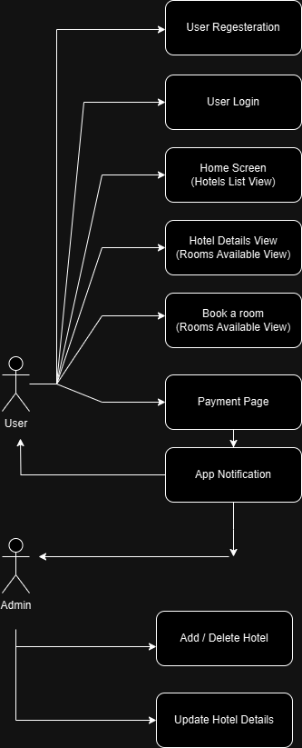

# **Requirement Analysis in Software Development.**

- ## **What is Requirement Analysis?**

  Welcome to the **Requirement Analysis in Software Development** repository, This repository dedicated to crafting a comprehensive foundation for software development by documenting, analyzing, and structuring requirements.

  **Requirement Analysis in Software Development** is a critical phase in the software development lifecycle (SDLC) where the project team gathers, analyzes, and defines the requirments of the software product to be developed.

  This process ensures that all stakeholdes have a clear and mutual understanding of what the system should do and how it should perform.

---

- ## **Why is Requirement Analysis Important?**

  - **Ensure Clear Understanding of Project Goals:**

    It helps in understanding what the stackholders expect from the software, This clarity ensures that the development team aligns their work with the intended purpose of the software, reducing misunderstanding and miscommunicatin.

  - **Scope Defination of Project:**

    Clearly defines the scope of the project, It defines what is included and excluded from the project to ensure clear expectations among stackholders and to guide the project tream effectively.

  - **Basic for Design and Development:**

    - **Provides a solid foundation for designing and developing the system.**
    - **Design** docuses on planing and structuring the solution to meet needs and project goal, It involves creating a blueprint for development.
    - **Development** involves transforming the design into a functional product using programming languages and tools

  - **Cost and Time Estimation:**
    Facilitaties accurate estimation of project cost, resources, and time, Acurate estimations ensure that projects are delevered on time, with budget, and meet stakeholder expectations.

  - **Quality Assurance(QA):**
    Ensures that the final product meets the specified requirments, leading to higher customer satisfaction, QA is focused on improving the development and testing to prevent defects before they occur, rather than identifying them after they happen.

---

- ## **Key Activities in Requirement Analysis.**

  - **Requirement Gathering**

    - **Ojective:** Collect initial requirements and insights from stakeholders to understand project needs.
    - **Activities:**
      - Conduct interviews with stakeholders to understand their expectations and objectives.
      - Organize brainstorming sessions to generate ideas and gather diverse inputs.
      - Distribute surveys or questionnaires for structured feedback.
      - Observe existing workflows and processes to identify gaps and improvement areas.
      - Hold workshops and focus group discussions to clarify needs and encourage collaboration.

  - **Requirement Elicitation**

    - **Ojective:** Elicit detailed and specific requirements from stakeholders to refine the project's scope.
    - **Techniques:**
      - Prototyping: Develop mockups or wireframes to visualize requirements.
      - Use Cases and Scenarios: Identify interactions between users and the system.
      - Storyboarding: Create visual narratives of user interactions.
      - Stakeholder Analysis: Identify key stakeholders and their influence on requirements.

  - **Requirement Documentation**

    - **Ojective:** Create clear, concise, and detailed documentation of all requirements.
    - **Activities:**
      - Write the Software Requirement Specification (SRS) document.
      - Separate requirements into functional (what the system should do) and non-functional (system performance, security, etc.).
      - Use diagrams like flowcharts and data flow diagrams for better visualization.
      - Ensure the documentation is accessible and understandable to all stakeholders.

  - **Requirement Analysis and Modeling**

    - **Ojective:** Evaluate and organize requirements to ensure they are feasible, consistent, and aligned with project goals.
    - **Activities:**
      - **Analysis:** Resolve conflicts, identify dependencies, and validate completeness.
      - **Modeling:** Create visual representations using:
        - Use Case Diagrams: To show interactions between users and the system.
        - Entity-Relationship Diagrams (ERDs): To model database relationships.
        - Data Flow Diagrams (DFDs): To map workflows and processes.
        - State Diagrams: To represent system behavior in different states.

  - **Requirement Validation.**

    - **Ojective:** Verify that the documented requirements meet stakeholder needs and are feasible to implement.
    - **Activities:**
      - Conduct walkthroughs and reviews of the requirements document with stakeholders.
      - Use prototypes to demonstrate and validate requirements visually.
      - Create test cases to ensure requirements are testable.
      - Resolve ambiguities and discrepancies based on stakeholder feedback.
      - Obtain formal sign-off from stakeholders on the finalized requirements.

---

- ## **Types of Requirements.**

  In the context of **Booking Managment Project** requirments are categorized into:

  - **Functional Requirements:**
    Functional requirements define the specific behavior, functionality, or operations of the system. These are the "what" of the system.

    - **User Registration**
      Users should able to create an account with personal details, login credential.

    - **User Authenticaton:**
      Secure login, registration process for users.

    - **Property Listing:**
      Display Hotels with some details (price, images, ...etc).

    - **Search Functionality:**

      - divided in two categories:
        - The CDN app: The content will apear like a nearby hotels, recommendations, offers, .... etc
        - The Users app: Users will able to search for a hotel and Book it.

    - **Book Functionality:**
      User should able to create, Update, view, Cancel bookings.

    - **Payment Functionality:**
      The system must process payments securely a payment gateway.

    - **User Notifications:**
      User should recieve a notification within the app.

  - **Non-Functional Requirements:**

    - **Performance:**

      - A CDN ensures faster loading times by delivering content from servers closest to the user.
      - Use master-slave architecture to reduce the load in the database.

    - **Scalability:**

      - CDNs handle high traffic by distributing the load across multiple servers.
      - The system should be able to scale horizontally to handle increased traffic.

    - **Security:**

      - CDNs protect against DDoS attacks and improve secure delivery of content.
      - Ensure data encryption, secure login, and protect against common vulnerabilities.

    - **Usability:**

      The application should have an intuitive UI/UX, making it easy for users to navigate and perform tasks.

    - **Reliability:**

      The system should have an uptime of 99.9% and recover quickly from any failures.

---

- ## **Use Case Diagrams.**

  - **Objective:**
    A Use Case Diagram is a visual representation of the interactions between actors (users or systems) and the system itself.

  - **Benefits of Use Case Diagrams:**

    - Provide a clear visual representation of system functionalities.
    - Help in identifying and organizing system requirements.
    - Facilitate communication among stakeholders and development team.

  - **Here are an example of a Use Case Diagram for a Booking Management System**

    

---

- ## **Acceptance Criteria:**

  - **Objective:** Establishing clear criteria for feature completion.

    - What is Acceptance Criteria?
      Acceptance criteria are a set of conditions that a software feature or product must meet to be accepted by stakeholders, such as the client or end-users. These criteria define the boundaries of a user story or feature and ensure that all parties involved have a shared understanding of the expected outcome.

  - **Example:** Acceptance Criteria for Checkout Feature in a Booking Management System

    - The Checkout Feature should meet the following acceptance criteria:

      - **Functional Requirements:** - The system must allow users to review their booking details, including dates, times, and costs, on the checkout page. - Users must be able to enter payment details, including card information or select other payment methods (e.g., PayPal). - The system must validate payment information before processing the transaction. - Upon successful payment, users should receive a confirmation email with booking details.

        - **Non-Functional Requirements:**

          - The checkout process must not exceed 5 seconds under normal conditions.
          - All payment transactions must be encrypted using SSL.
          - The checkout page must be responsive and functional across desktop, tablet, and mobile devices.

        - **Error Scenarios:**
          - If the payment fails, the system must display an error message and allow the user to retry.
          - If the booking details are invalid (e.g., unavailable slots), the system must notify the user and redirect them to the booking page.
